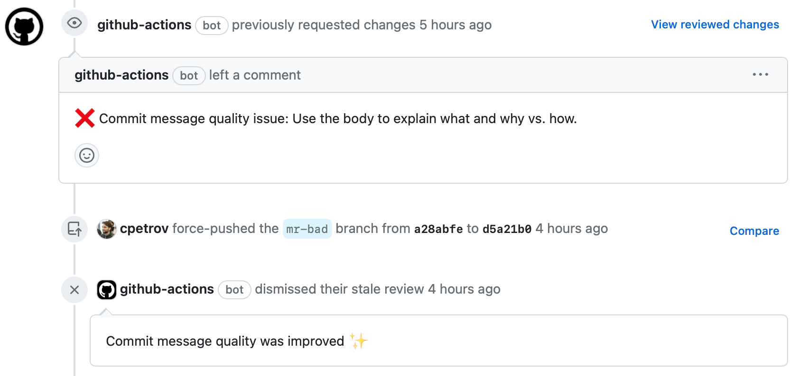
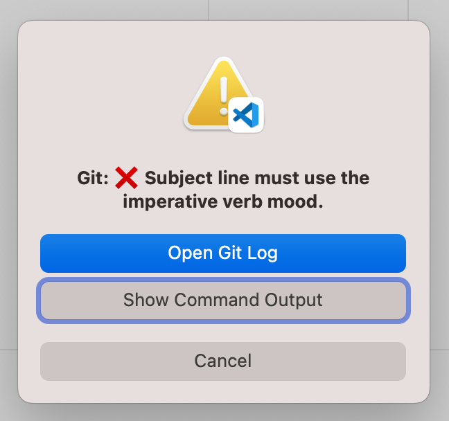

# Beams Commit Message Checker

This project provides a GitHub action and a local Git commit hook that check the quality of your commit messages according to Chris Beams' popular article ["7 rules of a good commit message"](https://cbea.ms/git-commit/).
It is the first practical tool to check rule 7 "Use the body to explain what and why vs. how", using a fine-tuned [CodeBERT](https://github.com/microsoft/CodeBERT) model that can be run on your machine.

| GitHub Action | Local hook, Visual Studio Code |
|---|---|
|  |  |

## Features

- **GitHub action**: Automatically requests changes on pull requests when the PR's `HEAD` commit message does not adhere to [Beams' 7 rules](https://cbea.ms/git-commit/).
- **Git commit hook**: Enables local checking of commit message quality according to [Beams' 7 rules](https://cbea.ms/git-commit/), ensuring privacy and providing faster feedback.

## Setup

### GitHub action

Add the following job to your project workflow file (e.g. `.github/workflows/main.yml`):

```yaml
on: [pull_request]

jobs:
  check-commit-message:
    runs-on: ubuntu-latest
    name: Check commit message
    permissions:
      pull-requests: write # required to post pull request comments
      contents: read # required to read commit information
    steps:
      - name: Checkout
        uses: actions/checkout@v3
      - name: Check commit message
        uses: actions/beams-commit-message-checker@v0.1.0
```

The action will reject the pull request with a comment if the `HEAD` commit message does not adhere to [Beams' 7 rules](https://cbea.ms/git-commit/). The rejection will be dismissed once the quality of the `HEAD` commit message is improved.

### Git hook

Make sure you have Docker installed on your machine. If not, follow the instructions [here](https://docs.docker.com/get-docker/).

Install the Git commit hook:

```bash
./install-local-hook.sh <project-path>
```

The hook script will be executed every time you run `git commit` and will reject the commit if the commit message does not adhere to Beams' 7 rules.

To uninstall the Git commit hook, run:

```bash
./uninstall-local-hook.sh <project-path>
```

## License

This project is licensed under the MIT License - see the [LICENSE.md](LICENSE.md) file for details.

## Acknowledgments

- [Chris Beams](https://chris.beams.io/posts/git-commit/) for his excellent guideline on commit messages.
- D. Faragó, M. Färber, and C. Petrov, “A Full-fledged Commit Message Quality Checker Based on Machine Learning,” 2023 IEEE 47th Annual Computers, Software, and Applications Conference (COMPSAC), May 2023, which this project is based on.
